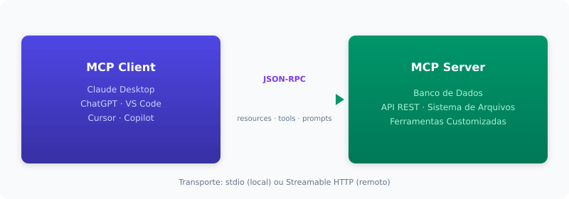

# IA no Desenvolvimento de Software
## Base comum de conceitos para o time de engenharia

---

## Objetivos

- Introduzir e alinhar conceitos novos da AIASE
- Eliminar ruídos e ambiguidades

**Agenda**

| # | Tópico |
|---|--------|
| 1 | Modelos de LLM — o que são, quais existem |
| 2 | Tokens e custos — a economia da IA |
| 3 | Commands / Prompts — como falar com a IA |
| 4 | Protocolo MCP — conectando a IA ao mundo |
| 5 | Protocolo A2A — agentes conversando entre si |
| 6 | RAG — busca + geração |
| 7 | Engenharia de contexto — o que a IA enxerga |
| 8 | Agentes de IA — autonomia em ação |
| 9 | Skills — módulos de conhecimento reutilizável |
| 10 | Harness — o ambiente completo de execução |

---

# 1. Modelos de LLM

---

## O que é um LLM?

**Large Language Model** — rede neural treinada sobre conjunto massivo de
texto e código.

- Entrada: texto (prompt) → Saída: texto (completion)
- Funcionamento: predição de próximo token — **não é raciocínio consciente**

| Confusão comum | Realidade |
|----------------|-----------|
| "A IA pensa" | Prevê tokens probabilisticamente; não há consciência |
| "O modelo sabe tudo" | Sabe o que estava nos dados de treino até a data de corte |
| "LLM = ChatGPT" | ChatGPT é produto; GPT é o modelo. Também existem Claude, Gemini, Llama, DeepSeek |
| "Quanto maior, melhor" | Modelos menores e especializados em código frequentemente superam genéricos maiores |

---

## Principais LLMs para código (Jun/2026)

| Modelo | Fornecedor | Acerto em bugs reais (SWE-bench) | Custo (input/output 1M tokens) |
|--------|-----------|--------------------|--------------------------------|
| Claude Opus 4.8 | Anthropic | 88,6% | $5 / $25 |
| Claude Opus 4.7 | Anthropic | 87,6% | $5 / $25 |
| GPT-5.5 | OpenAI | 82,6% | $5 / $30 |
| Claude Sonnet 4.6 | Anthropic | 79,6% — melhor custo-benefício | $3 / $15 |
| DeepSeek V4 Pro | DeepSeek | 80,6% — líder open-weight | $0,43 / $0,87 |
| Gemini 3.1 Pro | Google | 80,6% — multimodal, 1M contexto | $2 / $12 |

Fontes: [1] [2] [3] [4] — ver slide de referências ao final.
SWE-bench: % de bugs reais de GitHub resolvidos pelo agente de forma autônoma.

**Modelos abertos (open-weight):**

| Modelo | Destaque | Licença |
|--------|----------|---------|
| Qwen3-32B | Melhor open-weight para código | Apache 2.0 |
| Granite Code 34B | IBM, foco enterprise | Apache 2.0 |
| StarCoder 3 | Totalmente aberto (dados + código + pesos) | OpenRAIL |

---

## Modelos abertos vs fechados: onde está a diferença?

Em tarefas simples (escrever uma função), modelos abertos e fechados têm
desempenho próximo — a qualidade do código gerado é similar.

A diferença real aparece em **tarefas complexas e autônomas**: resolver
bugs em repositórios reais com centenas de arquivos, onde o agente precisa
planejar, buscar contexto, editar múltiplos arquivos e verificar o resultado.

| Cenário | Taxa de acerto (SWE-bench Verified) |
|---------|--------------------------------------|
| Modelo open-weight + agente open-source básico | ~50-65% |
| Modelo fechado + harness proprietário completo | ~80-88% |
| Claude Opus 4.7 + Claude Code | 87,6% |

> Não é o modelo puro que faz a diferença — é o **harness** que direciona,
> restringe e estabiliza o modelo durante a execução autônoma.

---

# 2. Tokens e custos

---

## O que é um token e por que importa?

Token é a **unidade atômica de processamento** de um LLM.
~1 token = ~4 caracteres em português (~0,75 palavras em inglês).

| Referência | Tokens |
|------------|--------|
| "IA" | 1 |
| "desenvolvimento" | 3 |
| Uma página A4 (~500 palavras) | ~650 |
| Arquivo de 1000 linhas de código | ~3.000-5.000 |

**Por que importa:**
- **Custo:** provedores cobram por token processado
- **Janela de contexto:** limite máximo por requisição (128K a 1M tokens em 2026)
- **Qualidade:** excesso de contexto degrada respostas (efeito "lost in the middle")

---

## Estrutura de custo

- **Input tokens:** o que você envia (prompt, contexto, ferramentas)
- **Output tokens:** o que o modelo gera — custa **3 a 6x mais** que input
- **Prompt caching:** se o início do contexto (system prompt, tools) for idêntico entre chamadas consecutivas, o provedor reaproveita a computação já feita e cobra ~90% menos por esses tokens

| Faixa | Exemplos | Input/1M tokens |
|-------|----------|-----------------|
| Ultra-baixo | GPT-5 Nano ($0,05), Gemini Flash-Lite ($0,10) | $0,05 - $0,25 |
| Produção | Claude Sonnet 4.6 ($3), GPT-5.4 ($2,50) | $2,50 - $3,00 |
| Frontier | Claude Opus 4.7 ($5), GPT-5.5 ($5) | $5,00 |

Fontes: preços oficiais de Anthropic [1], OpenAI [3], Google [4].

**Cenário realista:** agente refatora um módulo de 15 arquivos
(~30 min de trabalho):

- Lê 15 arquivos, escreve as versões refatoradas, ~20 turnos de ida e volta
- ~1M tokens de input acumulados nos 20 turnos, ~40K tokens de output
- **Sem cache (primeira execução):**

| Modelo | Custo da tarefa |
|--------|----------------|
| DeepSeek V4 Flash ($0,14/$0,28) | $0,15 |
| DeepSeek V4 Pro ($0,43/$0,87) | $0,47 |
| Claude Sonnet 4.6 ($3/$15) | $3,60 |
| Claude Opus 4.7 ($5/$25) | **$6,00** |
| GPT-5.5 ($5/$30) | $6,20 |

- **Com cache (segunda execução em diante):** o system prompt e tools
  já estão cacheados (90% de desconto no input)

| Modelo | Custo da tarefa |
|--------|----------------|
| DeepSeek V4 Flash | $0,01 |
| DeepSeek V4 Pro | $0,04 |
| Claude Sonnet 4.6 | $0,90 |
| Claude Opus 4.7 | $1,50 |
| GPT-5.5 | $1,70 |

> Um bug complexo pode consumir **$6 em 30 min** na primeira execução
> (Opus 4.7), mas cai para **$1,50** nas execuções seguintes com cache.
> Modele o custo antes de escolher o modelo: o barato resolve 80% do
> dia a dia; reserve o frontier para tarefas críticas.

---

# 3. Commands / Prompts

---

## O que é um prompt?

**Prompt** é tudo que você envia ao LLM para guiar sua resposta.
Não é só "uma pergunta" — é um artefato de engenharia com múltiplos
componentes.

Os **4 componentes** de uma chamada ao modelo:

| Componente | O que é | Quem define |
|------------|---------|-------------|
| System prompt | Papel, tom, regras, restrições de comportamento | O harness (AGENTS.md, config) |
| User prompt | A tarefa ou pergunta específica | O desenvolvedor |
| Tool definitions | Esquema JSON das ferramentas disponíveis | MCP + código do agente |
| Conversation history | Histórico de mensagens anteriores | Automático (acumulado a cada turno) |

---

## System prompt — exemplo real

Define **quem** o modelo é e **como** deve se comportar.
Injetado pelo harness, não pelo usuário.

```
Você é um engenheiro de software sênior especializado em Python.
Regras:
- Use type hints em todas as funções
- Prefira dataclasses a dicionários
- Testes com pytest, cobertura mínima de 80%
- Nunca use `except Exception` genérico
- Explique mudanças não-triviais com comentários concisos
```

> O system prompt é fixo e cacheado — trocá-lo a cada chamada
> quebra o cache e aumenta o custo em até 10x.

---

## User prompt + Histórico — exemplo real

**User prompt** — a tarefa enviada a cada turno:

```
Refatore o módulo `payment.py`: extraia a lógica de validação
de cartão para uma função separada `validate_card()`. Mantenha
os testes existentes passando.
```

**Conversation history** — acumulado automaticamente:

```
Turno 1: User: "Liste os arquivos do módulo de pagamento"
         Assistant: "Encontrei: payment.py, payment_test.py, gateway.py"
Turno 2: User: "Refatore o módulo payment.py..."
         Assistant: [resposta atual]
```

> Em agentes de 50+ turnos, o histórico é o maior consumidor da janela
> de contexto — é aqui que a engenharia de contexto se torna essencial.

---

## Prompt ≠ Command

| Prompt | Command |
|--------|---------|
| Instrução livre em linguagem natural | Atalho predefinido com comportamento conhecido |
| "Explique o que esse código faz e sugira melhorias" | `/review` — dispara fluxo de code review |
| Cada uso pode ser diferente | Sempre faz a mesma coisa |
| Ex: mensagem no chat | Ex: `/fix`, `/test`, `/explain`, `/deploy` |

> Commands são prompts **empacotados e reutilizáveis** — economizam tempo
> e garantem consistência. Quem define os commands disponíveis é o harness.

---

# 4. Protocolo MCP

---

## O que é o Model Context Protocol?

Protocolo **aberto e padronizado** para conectar IAs a sistemas externos
(dados, APIs, ferramentas).

- Criado pela Anthropic (Nov/2024), doado à **Linux Foundation** (Dez/2025)
- +97M downloads mensais nos SDKs Python e TypeScript
- +10.000 servidores públicos no registry oficial

> **Analogia:** MCP está para IA como **USB-C** para dispositivos —
> um conector universal. Na metáfora do corpo: são os **braços, pernas
> e sentidos** que permitem à IA interagir com o mundo externo.

Em 18 meses, tornou-se o **padrão de fato** da indústria: governança
neutra (AAIF, co-fundada por Anthropic, Block, OpenAI), suporte nativo
em Claude, ChatGPT, Gemini, VS Code, Cursor, Copilot, e 41% das
organizações de software já em produção (Stacklok 2026).

> O MCP não é mais um conceito emergente — é a camada padrão para
> sistemas de IA.

---

## O problema N×M resolvido

| Antes do MCP | Com MCP |
|--------------|---------|
| 5 modelos × 10 sistemas = **50 conectores** | 1 servidor por sistema = **10 servidores** |
| Código específico por par modelo-sistema | Compatível com qualquer modelo |
| Manutenção N×M | Manutenção 1 por sistema |



Transportes: stdio (local) ou Streamable HTTP (remoto, produção).

---

## MCP na prática

**Exemplo: servidor MCP do PostgreSQL**

Expõe ferramentas: `query`, `list_tables`, `describe_table`

```
Você: "Quantos usuários ativos temos esse mês?"

O agente recebe as tools no contexto e decide chamar:
  → query("SELECT COUNT(*) FROM users WHERE active = true")

O MCP Server executa no PostgreSQL (com as credenciais e
permissões definidas por você, não pelo agente)

Retorna: [{count: 15420}]

Agente: "Temos 15.420 usuários ativos este mês."
```

O agente não "sabe SQL" — ele recebe a ferramenta como opção, decide
usá-la, e o servidor MCP executa com segurança no ambiente controlado.

---

# 5. A2A

---

## O que é o Agent-to-Agent Protocol?

Protocolo **aberto** para comunicação entre agentes de IA — anunciado
pelo Google em Abril/2025, ainda **emergente** e com adoção menor que o MCP.

Enquanto o MCP conecta **agente ↔ ferramenta**, o A2A conecta
**agente ↔ agente**. Um agente pode delegar tarefas a outro agente,
mesmo que eles rodem em frameworks ou provedores diferentes.

**Como funciona:**
- Cada agente publica um **Agent Card** (cartão descritivo em JSON)
- O card informa: capacidades, endpoints, formato de entrada/saída
- Um agente descobre outro, lê o card e decide delegar uma subtarefa

---

# 6. RAG

---

## RAG — Retrieval-Augmented Generation

Técnica que combina **busca em base de conhecimento + geração LLM.**
Fundamenta respostas em dados reais, reduzindo alucinações.

```
Usuário pergunta → Busca documentos relevantes → Injeta no contexto → LLM responde
```

**Evolução do RAG:**

| Geração | Período | Característica |
|---------|---------|----------------|
| Naive RAG | 2020-2023 | Busca simples (top-k) + geração |
| Advanced RAG | 2023-2025 | Query rewriting, hybrid search, re-ranking |
| Agentic RAG | 2025+ | O agente decide **se, quando e onde** buscar; auto-verifica resultado |

**Exemplo Agentic RAG em 2026:**
1. Usuário: "Qual a política de reembolso para clientes premium?"
2. Agente avalia: preciso de informação externa → ativa busca
3. Decide fonte: vector store de documentos internos (não web search)
4. Recebe 5 chunks → avalia relevância → 2 são úteis, descarta 3
5. Gera resposta com citações: "Conforme doc POL-2026-03, seção 4.2..."

> RAG é o componente mais importante de engenharia de contexto para
> sistemas que precisam de precisão factual.

---

# 7. Engenharia de contexto

---

## O que é engenharia de contexto?

Disciplina de fazer a **curadoria** de tudo que o modelo vê em cada etapa
da execução.

- Prompt engineering: otimiza **o que você diz**
- Context engineering: otimiza **o que o modelo enxerga**

**Por que curadoria importa:** em agentes que executam dezenas de turnos,
o prompt inicial é uma fração mínima do que o modelo processa. O resto é
histórico de conversa, resultados de ferramentas e documentos — um volume
de informação que cresce rápido e, se não for curado, degrada a qualidade.

**As 3 ações da curadoria de contexto:**

| Ação | O que faz |
|------|-----------|
| **Selecionar** | Trazer só a informação relevante para a tarefa |
| **Comprimir** | Reduzir o que é acessório sem perder o essencial |
| **Isolar** | Separar contextos entre agentes especializados |

> Prompt engineering é sobre o cardápio. Context engineering é sobre
> os ingredientes que chegam à cozinha — e em que quantidade.

---

## Contexto na prática

**Cenário:** agente precisa corrigir um bug na lógica de desconto em um
repositório com 200 arquivos.


> A diferença não está no modelo nem no prompt — está na **curadoria
> do contexto**: selecionar só o relevante, comprimir o acessório e
> isolar o que cada agente realmente precisa ver.

---

# 8. Agentes de IA

---

## O que é um agente?

Um **agente** é um sistema onde um LLM decide autonomamente o que fazer
em seguida — chamando ferramentas — até atingir um objetivo.

```
Loop do agente (ReAct):
  Observar resultado → Raciocinar sobre próximo passo → Agir (tool call) → ...
  Até: objetivo atingido ou condição de parada
```

**A distinção que causa confusão:**

A palavra "agente" é usada para **duas coisas diferentes**. Entender isso
elimina a principal fonte de ruído nas conversas.

---

## Os dois significados de "agente"

| | Agente-Ferramenta (Tool Agent) | Agente Customizado |
|---|------|------|
| **O que é** | Software com acesso real ao sistema: lê arquivos, executa comandos, usa git, chama APIs | Um system prompt + skills + tools que roda **dentro** de um agente-ferramenta |
| **Exemplos** | Claude Code, OpenCode, Cursor Agent, Codex CLI, Devin | "Agente Engenheiro de Software", "Agente de Code Review", "Agente de QA" |
| **Quem define** | O provedor da ferramenta (Anthropic, OpenAI, etc.) | **Você**, via configuração (AGENTS.md, skills, tools) |
| **O que faz** | Gerencia o loop, executa comandos reais, persiste sessão | Define personalidade, escopo de conhecimento, regras de atuação |
| **Analogia** | O **computador** e seu sistema operacional | O **programa** que roda nesse computador |

---

## Exemplo concreto da distinção


O OpenCode/ClaudeCode é o **agente-ferramenta** (a plataforma).
O "Engenheiro de Software Sênior Python" é um **agente customizado**
(a configuração que roda nessa plataforma).

---

# 9. Skills

---

## O que é uma Skill?

Unidade de **conhecimento + fluxo de trabalho reutilizável**, carregada
sob demanda pelo agente.

| Ferramenta | Skill |
|------------|-------|
| Função atômica: `search_db(query)` | Fluxo completo: pesquisar → sumarizar → apresentar |
| Sempre listada nas tools disponíveis | Corpo carregado só quando ativada |

> Ferramentas são **funções**. Skills são **módulos** compostos de
> múltiplas funções e conhecimento de domínio.

---

## Como o mecanismo de Skills funciona

O que o agente **sempre** vê no contexto (catálogo):

```
Skills disponíveis:
  code-review — Revisa PRs aplicando padrões da empresa
  deploy-check — Verifica pré-requisitos de deploy
  security-audit — Analisa vulnerabilidades OWASP Top 10
```

Apenas o **nome + descrição de 1 linha** de cada skill consome tokens
do contexto. O corpo (SKILL.md) **não está no contexto ainda.**

Quando o agente decide que precisa de uma skill, o harness carrega o
arquivo `SKILL.md` completo e injeta no contexto como mensagem do sistema.

---

## Exemplo de ativação de Skill

**Antes da ativação** (contexto do agente):

```
System: Você é um engenheiro de software sênior.
Tools: bash, read_file, write_file, search_code...
Skills: code-review (Revisa PRs...), security-audit (OWASP...)
User: Revise o PR #342
```

**O agente raciocina:** "Preciso revisar um PR → skill `code-review`"

**Depois da ativação** (SKILL.md injetado no contexto):

```
System: [conteúdo completo de code-review/SKILL.md]
  Passo 1: Leia o diff do PR
  Passo 2: Classifique mudanças por categoria (segurança, lógica, estilo)
  ...
```

> Isso se chama **Progressive Disclosure** (divulgação progressiva):
> o prefixo estável (catálogo) não muda → KV-cache preservado.
> O corpo da skill só ocupa tokens quando realmente necessário.

---

# 10. Harness

---

## O que é um Harness?

> **Agente = Modelo + Harness**

**Analogia do arreio (harness = arreio de cavalo):**

Um cavalo (LLM) tem força bruta, mas sem arreio (harness) você não
controla para onde ele vai, o que ele carrega, nem como ele para.

O **harness** é o conjunto completo de rédeas, guias, sensores e
barreiras que transforma um LLM puro em um agente funcional e seguro.

**Os 5 componentes do arreio:**

| Peça do arreio | Função | Exemplo no código |
|----------------|--------|-------------------|
| **AGENTS.md** (rédea) | Direciona o comportamento | "Use tabs. Testes: pytest. Não mexer em /infra." |
| **Skills** (bagagem) | Conhecimento carregado sob demanda | Code review, deploy, migração de DB |
| **MCP** (conexões) | Liga o cavalo ao mundo externo | Servidor MCP do banco, da API interna |
| **Hooks** (freio) | Bloqueiam ações perigosas | PreToolUse: "não execute rm -rf" |
| **Sub-agentes** (cavalos especializados) | Dividem a carga | Um para segurança, outro para testes, outro para docs |


---

## Por que Harness é a camada que importa?

- O mesmo modelo (ex: Claude Sonnet 4.6) produz resultados **10x diferentes** dependendo do harness
- Modelos são commodities — **a diferenciação está no ambiente**
- Resolve o que prompts sozinhos não resolvem:
  - **Segurança:** hooks bloqueiam ações perigosas (prompts podem ser ignorados; hooks, não)
  - **Consistência:** skills garantem o mesmo padrão sempre
  - **Escala:** sub-agentes paralelizam o trabalho

**AGENTS.md — a rédea:**
- Arquivo na raiz do repo, injetado deterministicamente no system prompt
- Máximo 300 linhas (ideal <60)
- O que o agente DEVE e NÃO DEVE fazer, comandos de build/test, critérios de conclusão

**Hooks — o freio:**
- `PreToolUse`: validar antes de executar (exit code 2 = bloquear)
- `PostToolUse`: verificar output depois de executar
- Exemplo: hook que bloqueia `rm -rf /` ou `DROP TABLE` em produção

---


---

## Obrigado! Perguntas?

---

# Apêndice: Referências

## Preços de API (Junho 2026)

[1] **Anthropic API Pricing.** https://platform.claude.com/docs/en/about-claude/pricing
    - Claude Opus 4.7: $5/$25. Sonnet 4.6: $3/$15. Haiku 4.5: $1/$5.

[2] **OpenAI API Pricing.** https://openai.com/api/pricing/
    - GPT-5.5: $5/$30. GPT-5.4: $2.50/$15.

[3] **DeepSeek API Pricing.** https://api-docs.deepseek.com/quick_start/pricing
    - V4 Pro: $0.435/$0.87 (promo permanente desde Mai/2026). V4 Flash: $0.14/$0.28.

[4] **Google Gemini Pricing.** https://ai.google.dev/pricing
    - Gemini 2.5 Flash: $0.30/$2.50. Gemini 3.1 Pro: $2/$12.

## SWE-bench Verified (Junho 2026)

[5] **SWE-bench Verified Leaderboard.** https://www.swebench.com/verified
[6] **Steel.dev Leaderboard.** https://leaderboard.steel.dev/leaderboards/swe-bench-verified/
[7] **BenchLM.ai.** https://benchlm.ai/benchmarks/sweVerified
[8] **Vals.ai.** https://vals.ai/benchmarks/swebench

## MCP — Protocolo e adoção

[9] **Anthropic — Donating MCP to AAIF (Dez/2025).** https://www.anthropic.com/news/donating-the-model-context-protocol
[10] **NeuralCoreTech — "Why MCP Became the Standard" (Mai/2026).** https://neuralcoretech.com/model-context-protocol-mcp-2026-agentic-ai-standard/
[11] **AgentMarketCap — "MCP at 17 Months" (Abr/2026).** https://agentmarketcap.ai/blog/2026/04/23/mcp-17-month-anniversary-10k-servers-97m-downloads-category-standard
[12] **Digital Applied — "MCP Ecosystem H1 2026 Retrospective" (Mai/2026).** https://www.digitalapplied.com/blog/mcp-ecosystem-h1-2026-retrospective-adoption-data-points
[13] **MCP Blog — "2026-07-28 Release Candidate" (Mai/2026).** https://blog.modelcontextprotocol.io/posts/2026-07-28-release-candidate/

## Harness, contexto e agentes

[14] **amux — "Harness Engineering Guide" (Mai/2026).** https://amux.io/guides/harness-engineering/
[15] **HumanLayer — "Skill Issue: Harness Engineering" (Mar/2026).** https://www.humanlayer.dev/blog/skill-issue-harness-engineering-for-coding-agents
[16] **ArXiv — "Building AI Coding Agents for the Terminal" (Mar/2026).** https://arxiv.org/html/2603.05344v1
[17] **ypollak2 — "Context Engineering Handbook" (Mar/2026).** https://github.com/ypollak2/context-engineering-handbook

---


