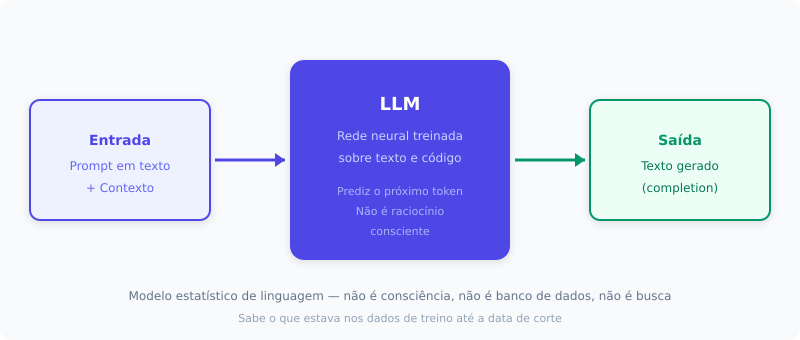
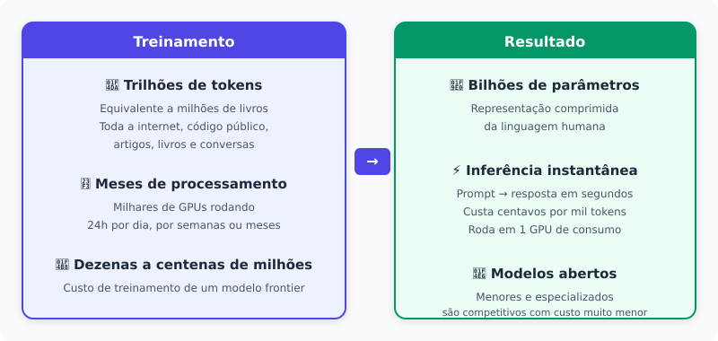
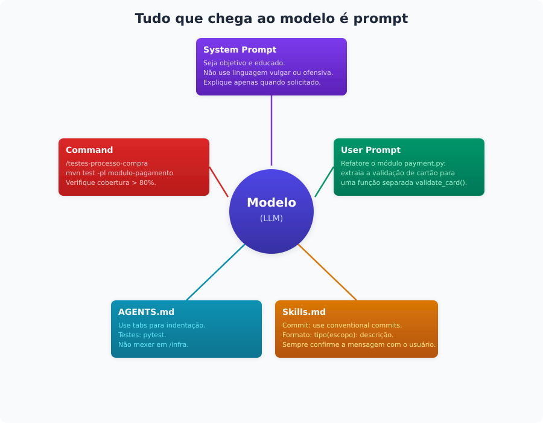
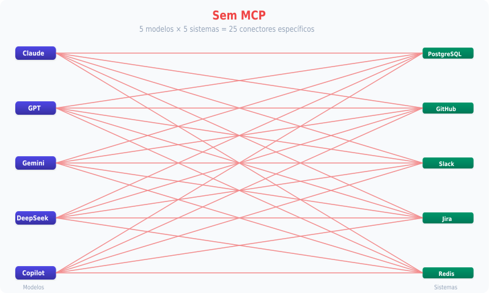
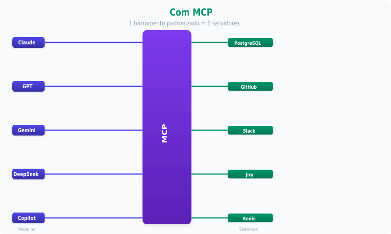
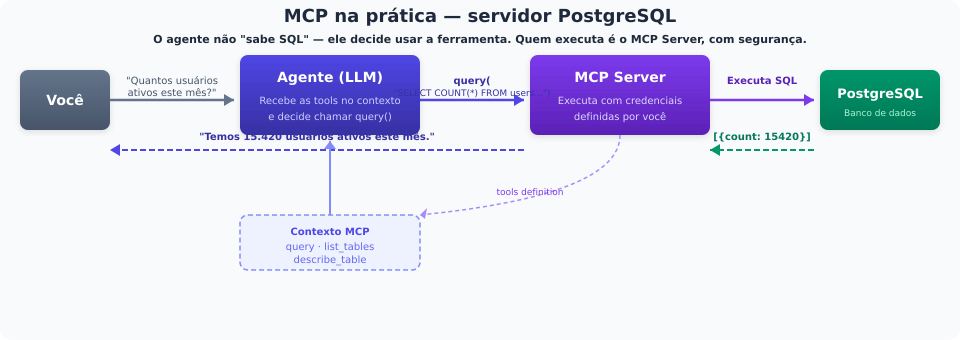
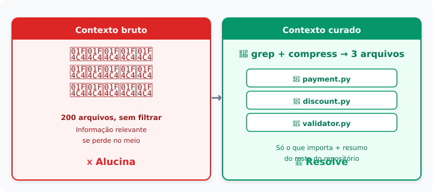
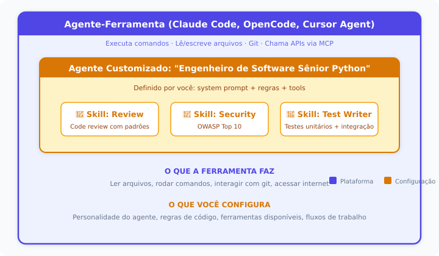
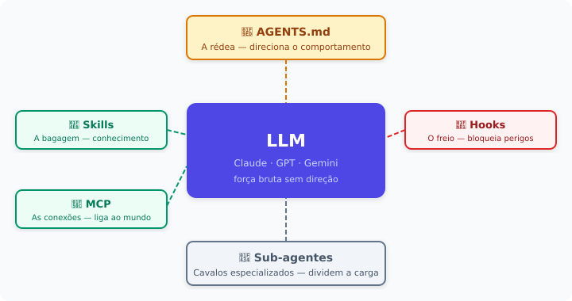
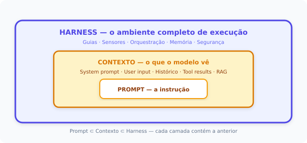

# IA no Desenvolvimento de Software
## Base comum de conceitos para o time de engenharia

---

## Objetivos

- Introduzir e alinhar conceitos novos da AIASE
- Eliminar ruídos e ambiguidades

**Agenda**

| # | Tópico |
|---|--------|
| 1 | Modelos de LLM — o que são, quais existem |
| 2 | Prompts — como falar com a IA |
| 3 | Protocolo MCP — conectando a IA ao mundo |
| 4 | Protocolo A2A — agentes conversando entre si |
| 5 | RAG — busca + geração |
| 6 | Engenharia de contexto — tokens, custos e otimização |
| 7 | Agentes de IA — autonomia em ação |
| 8 | Skills — módulos de conhecimento reutilizável |
| 9 | Harness — o ambiente completo de execução |

---

# 1. Modelos de LLM

---

## O que é um LLM?

[](docs/o-que-e-llm.md)

---

## Construindo um LLM

[](docs/escala-llm.md)

---

## LLMs e seus custos

| Modelo | Acerto em bugs reais (SWE-bench) | Custo |
|--------|--------------------------------|-------|
| Claude Opus 4.8 | 88,6% (Verified) | $5 / $25 (API) |
| GPT-5.5 | 82,6% (Verified) | $5 / $30 (API) |
| Claude Sonnet 4.6 | 79,6% (Verified) | $3 / $15 (API) |
| DeepSeek V4 Pro | 80,6% (Verified) | $0,43 / $0,87 (API) |
| GLM-5.2 | 62,1% (Pro) | ~$15.000 (servidor, 4× H100 80GB) |
| Qwen3-32B | 16,3% (Lite) | ~$4.000 (Mac Studio 128GB) |

---

# 2. Prompts

---

## O que é um prompt?

**Prompt** é tudo que chega ao modelo — não importa a origem:
system prompt, user prompt, skills, comandos, AGENTS.md. Tudo vira prompt.

[](docs/prompt-componentes.md)

---

# 3. Protocolo MCP

---

## O que é o Model Context Protocol?

Protocolo **aberto e padronizado** para conectar IAs a sistemas
externos (dados, APIs, ferramentas).

- Criado pela Anthropic (Nov/2024), doado à **Linux Foundation** (Dez/2025)
- +97M downloads mensais, +10.000 servidores no registry público
- Suporte nativo: Claude, ChatGPT, Gemini, VS Code, Cursor, Copilot
- Em 18 meses tornou-se o **padrão de fato** da indústria.

> **Analogia:** MCP está para IA como **USB-C** para dispositivos —
> um conector universal. Na metáfora do corpo: são os **braços, pernas
> e sentidos** da IA interagindo com o mundo.

---

## Sem MCP

[](docs/mcp-nxm.md)

---

## Com MCP

[](docs/mcp-nxm.md)

---

## MCP na prática

[](docs/mcp-fluxo.md)

---

# 4. A2A

---

## O que é o Agent-to-Agent Protocol?

Protocolo **aberto** para comunicação entre agentes de IA — anunciado
pelo Google em Abril/2025, ainda **emergente** e com adoção menor que o MCP.

Enquanto o MCP conecta **agente ↔ ferramenta**, o A2A conecta
**agente ↔ agente**. Um agente pode delegar tarefas a outro agente,
mesmo que eles rodem em frameworks ou provedores diferentes.

**Como funciona:**
- Cada agente publica um **Agent Card** (cartão descritivo em JSON)
- O card informa: capacidades, endpoints, formato de entrada/saída
- Um agente descobre outro, lê o card e decide delegar uma subtarefa

---

# 5. RAG

---

## RAG — Retrieval-Augmented Generation

Técnica que combina **busca em base de conhecimento + geração LLM.**
Fundamenta respostas em dados reais, reduzindo alucinações.

```
Usuário pergunta → Busca documentos relevantes → Injeta no contexto → LLM responde
```

**Evolução do RAG:**

| Geração | Período | Característica |
|---------|---------|----------------|
| Naive RAG | 2020-2023 | Busca simples (top-k) + geração |
| Advanced RAG | 2023-2025 | Query rewriting, hybrid search, re-ranking |
| Agentic RAG | 2025+ | O agente decide **se, quando e onde** buscar; auto-verifica resultado |

**Exemplo Agentic RAG em 2026:**

---

## RAG na prática
1. Usuário: "Qual a política de reembolso para clientes premium?"
2. Agente avalia: preciso de informação externa → ativa busca
3. Decide fonte: vector store de documentos internos (não web search)
4. Recebe 5 chunks → avalia relevância → 2 são úteis, descarta 3
5. Gera resposta com citações: "Conforme doc POL-2026-03, seção 4.2..."

> RAG é o componente mais importante de engenharia de contexto para
> sistemas que precisam de precisão factual.

---

# 6. Engenharia de contexto e custos

---

## Tokens e custos

Token é a **unidade atômica de processamento** de um LLM.
~1 token = ~4 caracteres em português.

- **Input tokens:** o que você envia (prompt, contexto, ferramentas)
- **Output tokens:** o que o modelo gera — custa **3 a 6x mais** que input
- **Prompt caching:** se o início do contexto (system prompt, tools) for
  idêntico entre chamadas consecutivas, o provedor reaproveita a computação
  já feita e cobra ~90% menos por esses tokens

| Faixa | Exemplos | Input/1M tokens |
|-------|----------|-----------------|
| Ultra-baixo | GPT-5 Nano ($0,05), Gemini Flash-Lite ($0,10) | $0,05 - $0,25 |
| Produção | Claude Sonnet 4.6 ($3), GPT-5.4 ($2,50) | $2,50 - $3,00 |
| Frontier | Claude Opus 4.7 ($5), GPT-5.5 ($5) | $5,00 |

---

## Cenário realista

agente refatora um módulo de 15 arquivos
(~30 min de trabalho):

- ~20 turnos, ~1M tokens de input acumulados, ~40K tokens de output

**Sem cache:**

| Modelo | Custo da tarefa |
|--------|----------------|
| DeepSeek V4 Pro ($0,43/$0,87) | $0,47 |
| Claude Sonnet 4.6 ($3/$15) | $3,60 |
| Claude Opus 4.7 ($5/$25) | **$6,00** |

**Com cache (segunda execução em diante):**

| Modelo | Custo da tarefa |
|--------|----------------|
| DeepSeek V4 Pro | $0,04 |
| Claude Sonnet 4.6 | $0,90 |
| Claude Opus 4.7 | $1,50 |

> Um bug pode consumir **$6 em 30 min** no Opus 4.7, mas cai para
> **$1,50** com cache. A engenharia de contexto reduz esse custo
> selecionando e comprimindo o que o modelo processa.

---

## Como otimizar: engenharia de contexto

As 3 ações da curadoria reduzem tokens e custo:

| Ação | O que faz | Impacto no custo |
|------|-----------|------------------|
| **Selecionar** | Trazer só o relevante | Menos tokens de input |
| **Comprimir** | Reduzir o acessório | Menos histórico no contexto |
| **Isolar** | Separar contextos entre agentes | Cada agente processa menos |

> Prompt engineering é sobre o cardápio. Context engineering é sobre
> os ingredientes que chegam à cozinha — e em que quantidade.

---

## Contexto na prática

**Cenário:** agente precisa corrigir um bug na lógica de desconto em um
repositório com 200 arquivos.

[](docs/contexto-comparacao.md)

> A diferença não está no modelo nem no prompt — está na **curadoria
> do contexto**: selecionar só o relevante, comprimir o acessório e
> isolar o que cada agente realmente precisa ver.

---

# 7. Agentes de IA

---

## O que é um agente?

Um **agente** é um sistema onde um LLM decide autonomamente o que fazer
em seguida — chamando ferramentas — até atingir um objetivo.

```
Loop do agente (ReAct):
  Observar resultado → Raciocinar sobre próximo passo → Agir (tool call) → ...
  Até: objetivo atingido ou condição de parada
```

**A distinção que causa confusão:**

A palavra "agente" é usada para **duas coisas diferentes**. Entender isso
elimina a principal fonte de ruído nas conversas.

---

## Os dois significados de "agente"

| | Agente-Ferramenta (Tool Agent) | Agente Customizado |
|---|------|------|
| **O que é** | Software com acesso real ao sistema: lê arquivos, executa comandos, usa git, chama APIs | Um system prompt + skills + tools que roda **dentro** de um agente-ferramenta |
| **Exemplos** | Claude Code, OpenCode, Cursor Agent, Codex CLI, Devin | "Agente Engenheiro de Software", "Agente de Code Review", "Agente de QA" |
| **Quem define** | O provedor da ferramenta (Anthropic, OpenAI, etc.) | **Você**, via configuração (AGENTS.md, skills, tools) |
| **O que faz** | Gerencia o loop, executa comandos reais, persiste sessão | Define personalidade, escopo de conhecimento, regras de atuação |
| **Analogia** | O **computador** e seu sistema operacional | O **programa** que roda nesse computador |

---

## Exemplo concreto da distinção

[](docs/agentes-camadas.md)

O OpenCode/ClaudeCode é o **agente-ferramenta** (a plataforma).
O "Engenheiro de Software Sênior Python" é um **agente customizado**
(a configuração que roda nessa plataforma).

---

# 8. Skills

---

## O que é uma Skill?

Unidade de **conhecimento + fluxo de trabalho reutilizável**, carregada
sob demanda pelo agente.

| Ferramenta | Skill |
|------------|-------|
| Função atômica: `search_db(query)` | Fluxo completo: pesquisar → sumarizar → apresentar |
| Sempre listada nas tools disponíveis | Corpo carregado só quando ativada |

> Ferramentas são **funções**. Skills são **módulos** compostos de
> múltiplas funções e conhecimento de domínio.

---

## Como o mecanismo de Skills funciona

O que o agente **sempre** vê no contexto (catálogo):

```
Skills disponíveis:
  code-review — Revisa PRs aplicando padrões da empresa
  deploy-check — Verifica pré-requisitos de deploy
  security-audit — Analisa vulnerabilidades OWASP Top 10
```

Apenas o **nome + descrição de 1 linha** de cada skill consome tokens
do contexto. O corpo (SKILL.md) **não está no contexto ainda.**

Quando o agente decide que precisa de uma skill, o harness carrega o
arquivo `SKILL.md` completo e injeta no contexto como mensagem do sistema.

---

## Exemplo de ativação de Skill

**Antes da ativação** (contexto do agente):

```
System: Você é um engenheiro de software sênior.
Tools: bash, read_file, write_file, search_code...
Skills: code-review (Revisa PRs...), security-audit (OWASP...)
User: Revise o PR #342
```

**O agente raciocina:** "Preciso revisar um PR → skill `code-review`"

**Depois da ativação** (SKILL.md injetado no contexto):

```
System: [conteúdo completo de code-review/SKILL.md]
  Passo 1: Leia o diff do PR
  Passo 2: Classifique mudanças por categoria (segurança, lógica, estilo)
  ...
```

> Isso se chama **Progressive Disclosure** (divulgação progressiva):
> o prefixo estável (catálogo) não muda → KV-cache preservado.
> O corpo da skill só ocupa tokens quando realmente necessário.

---

# 9. Harness

---

## O que é um Harness?

> **Agente = Modelo + Harness**

**Analogia do arreio (harness = arreio de cavalo):**

Um cavalo (LLM) tem força bruta, mas sem arreio (harness) você não
controla para onde ele vai, o que ele carrega, nem como ele para.

O **harness** é o conjunto completo de rédeas, guias, sensores e
barreiras que transforma um LLM puro em um agente funcional e seguro.

**Os 5 componentes do arreio:**

| Peça do arreio | Função | Exemplo no código |
|----------------|--------|-------------------|
| **AGENTS.md** (rédea) | Direciona o comportamento | "Use tabs. Testes: pytest. Não mexer em /infra." |
| **Skills** (bagagem) | Conhecimento carregado sob demanda | Code review, deploy, migração de DB |
| **MCP** (conexões) | Liga o cavalo ao mundo externo | Servidor MCP do banco, da API interna |
| **Hooks** (freio) | Bloqueiam ações perigosas | PreToolUse: "não execute rm -rf" |
| **Sub-agentes** (cavalos especializados) | Dividem a carga | Um para segurança, outro para testes, outro para docs |

[](docs/harness-arreio.md)

---

## Por que Harness é a camada que importa?

- O mesmo modelo (ex: Claude Sonnet 4.6) produz resultados **10x diferentes** dependendo do harness
- Modelos são commodities — **a diferenciação está no ambiente**
- Resolve o que prompts sozinhos não resolvem:
  - **Segurança:** hooks bloqueiam ações perigosas (prompts podem ser ignorados; hooks, não)
  - **Consistência:** skills garantem o mesmo padrão sempre
  - **Escala:** sub-agentes paralelizam o trabalho

**AGENTS.md — a rédea:**
- Arquivo na raiz do repo, injetado deterministicamente no system prompt
- Máximo 300 linhas (ideal <60)
- O que o agente DEVE e NÃO DEVE fazer, comandos de build/test, critérios de conclusão

**Hooks — o freio:**
- `PreToolUse`: validar antes de executar (exit code 2 = bloquear)
- `PostToolUse`: verificar output depois de executar
- Exemplo: hook que bloqueia `rm -rf /` ou `DROP TABLE` em produção

---

[](docs/hierarquia-ia.md)

---

## Obrigado! Perguntas?

---

# Apêndice: Referências

## Preços de API (Junho 2026)

[1] **Anthropic API Pricing.** https://platform.claude.com/docs/en/about-claude/pricing
    - Claude Opus 4.7: $5/$25. Sonnet 4.6: $3/$15. Haiku 4.5: $1/$5.

[2] **OpenAI API Pricing.** https://openai.com/api/pricing/
    - GPT-5.5: $5/$30. GPT-5.4: $2.50/$15.

[3] **DeepSeek API Pricing.** https://api-docs.deepseek.com/quick_start/pricing
    - V4 Pro: $0.435/$0.87 (promo permanente desde Mai/2026). V4 Flash: $0.14/$0.28.

[4] **Google Gemini Pricing.** https://ai.google.dev/pricing
    - Gemini 2.5 Flash: $0.30/$2.50. Gemini 3.1 Pro: $2/$12.

## SWE-bench Verified (Junho 2026)

[5] **SWE-bench Verified Leaderboard.** https://www.swebench.com/verified
[6] **Steel.dev Leaderboard.** https://leaderboard.steel.dev/leaderboards/swe-bench-verified/
[7] **BenchLM.ai.** https://benchlm.ai/benchmarks/sweVerified
[8] **Vals.ai.** https://vals.ai/benchmarks/swebench

## MCP — Protocolo e adoção

[9] **Anthropic — Donating MCP to AAIF (Dez/2025).** https://www.anthropic.com/news/donating-the-model-context-protocol
[10] **NeuralCoreTech — "Why MCP Became the Standard" (Mai/2026).** https://neuralcoretech.com/model-context-protocol-mcp-2026-agentic-ai-standard/
[11] **AgentMarketCap — "MCP at 17 Months" (Abr/2026).** https://agentmarketcap.ai/blog/2026/04/23/mcp-17-month-anniversary-10k-servers-97m-downloads-category-standard
[12] **Digital Applied — "MCP Ecosystem H1 2026 Retrospective" (Mai/2026).** https://www.digitalapplied.com/blog/mcp-ecosystem-h1-2026-retrospective-adoption-data-points
[13] **MCP Blog — "2026-07-28 Release Candidate" (Mai/2026).** https://blog.modelcontextprotocol.io/posts/2026-07-28-release-candidate/

## Harness, contexto e agentes

[14] **amux — "Harness Engineering Guide" (Mai/2026).** https://amux.io/guides/harness-engineering/
[15] **HumanLayer — "Skill Issue: Harness Engineering" (Mar/2026).** https://www.humanlayer.dev/blog/skill-issue-harness-engineering-for-coding-agents
[16] **ArXiv — "Building AI Coding Agents for the Terminal" (Mar/2026).** https://arxiv.org/html/2603.05344v1
[17] **ypollak2 — "Context Engineering Handbook" (Mar/2026).** https://github.com/ypollak2/context-engineering-handbook

---


